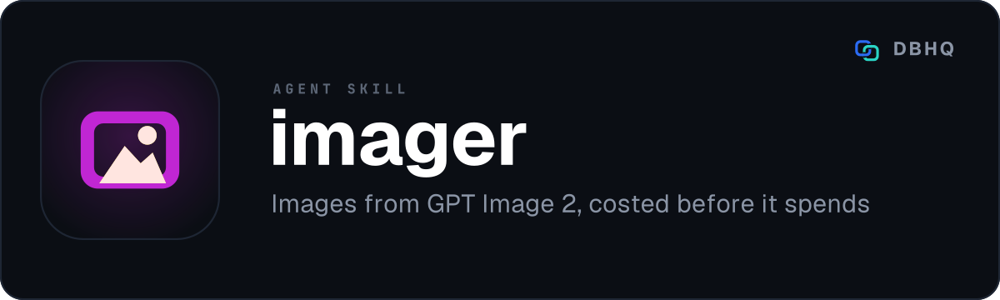

<div align="center">



# gpt-image-2

**Iterate on drafts, pay for the one you approved**

[](LICENSE)
[](https://code.claude.com/docs/en/plugins)
[]()

A free, open-source tool by [DBHQ](https://dbhq.uk)

</div>

---

Generate and edit images with OpenAI's GPT Image models, through a guided flow rather than a flag reference: what are we making, in which style, for where it is going, draft first, then final.

## What makes it different

**The draft loop is the point.** A low-quality draft costs about $0.006 against roughly $0.21 for a final, so the workflow generates a draft, shows it to you, and only spends the real money once you have said yes. Across a ten-slide carousel that is $0.06 to find the direction rather than $2.10.

**It tells you the cost before it spends it, and what it cost afterwards.** Every run estimates first. Below $0.50 it proceeds; at or above, it stops and asks. `--estimate` prices a batch without generating anything, and `--dry-run` prints the fully assembled prompt without making a request at all. Once the call returns, the token `usage` the API reports is turned into the real billed figure and logged, so the estimate stops being a guess: after three runs at the same model, quality and size, it uses their median. A tool that spends your money should never surprise you about how much.

**It knows a directory is a set.** `set-check` reads the history for the folder you are writing into and tells you which model and quality tier the images already there were made at - then matches them unless you say otherwise. This exists because a batch once went out at 35x the price it needed to, purely because a default said so.

**One dependency, and no vendor SDK.** PyYAML, for the catalogues. The API calls go out over `urllib` from the standard library. That is a deliberate trade: this is a skill that holds an API key, and the less third-party code sits between the key and the wire, the less there is for you to audit before you trust it.

**Presets that carry the whole prompt, not a style word.** 27 of them, each pairing a short description you choose from with a full prompt fragment that does the work - `editorial`, `blueprint`, `ink`, `risograph`, `wireframe`, `constellation`, `brutalist`, `grain`, `nordic`, `bauhaus` for visual work; `infographic`, `slide`, `diagram`, `poster`, `menu`, `manga` where the text in the image has to be legible; plus community favourites and a social set. Platform sizing for the eight places images actually go - and the image is generated at the platform's own aspect ratio, then scaled down, rather than generated square and cropped.

## Install

### Any agent (Claude Code, Codex, Cursor, Copilot, Windsurf, Gemini, Cline and more)

```bash
npx skills add dbhq-uk/gpt-image-2-skill
```

The [skills.sh](https://skills.sh) CLI installs into whichever agent directories it finds.

### Local install (Claude Code or Codex)

```bash
git clone https://github.com/dbhq-uk/gpt-image-2-skill.git
cd gpt-image-2-skill
./install.sh          # Claude Code: symlinks into ~/.claude/skills (edits are live)
./install-codex.sh    # Codex: installs into ~/.codex/skills
```

[`install.sh`](install.sh) and [`install-codex.sh`](install-codex.sh) are the same install two ways: Claude Code substitutes `${CLAUDE_SKILL_DIR}` so the whole skill directory is symlinked untouched, while Codex does not, so its `SKILL.md` is rewritten at install time. Both build a virtualenv inside the skill directory and install PyYAML into it.

### Requirements

- **Python 3.9+**
- **An OpenAI API key** in `OPENAI_API_KEY`. It is read from the environment and never written to disk by this skill. To route via OpenRouter instead, set `OPENROUTER_API_KEY` and pass `--provider openrouter`
- **ImageMagick** (optional) - needed only for platform resizing and carousel contact sheets

## Usage

Describe what you want and the skill takes it from there.

```
"generate an editorial image of a rocket"
"make me a 10-slide LinkedIn carousel about spreadsheet risk"
"turn this photo into the constellation style"
"a diagram of the OAuth flow, with readable labels"
"four variants of a mountain in ink style"
```

Or drive the CLI directly:

```bash
PY=~/.claude/skills/gpt-image-2/.venv/bin/python
GEN=~/.claude/skills/gpt-image-2/scripts/gpt_image_2.py

$PY $GEN --draft --preset editorial "a cat astronaut" out.png   # ~$0.006
$PY $GEN --quality high --preset editorial "a cat astronaut" out.png
$PY $GEN --model sunburst --quality xhigh --preset diagram "OAuth flow" out.png
$PY $GEN --background transparent "a line-art compass rose, isolated" logo.png
$PY $GEN --estimate --n 10 --quality high "batch test"          # price it, generate nothing
$PY $GEN --dry-run --preset diagram "OAuth flow" out.png        # show the prompt, call nothing
$PY $GEN set-check ./assets/icons/                              # what did this set use?
```

### Models

| Model | When |
|---|---|
| `gpt-image-2.5-flare` **(default)** | Everything, unless a reason says otherwise. About half the latency of `gpt-image-2` and fewer output tokens for the same tier. |
| `gpt-image-2.5-sunburst` | Fine detail, dense text, precision and multi-turn edits. Slower, same token rates. |
| `gpt-image-2` | Adding to a set generated on it, or a Batch API run - the 50% batch discount covers `gpt-image-2` and not the 2.5 models. |

`low`, `medium` and `high` on all three; `xhigh` and `max` on the 2.5 models. The default is
**low**, because the flow is draft-first.

### Prices

Published `gpt-image-2` figures at 1024x1024:

| Quality | Per image | Ten-slide carousel |
|---|---|---|
| `--draft` (low, the default) | $0.006 | $0.06 |
| medium | $0.053 | $0.53 |
| high | $0.211 | $2.11 |

Non-square is cheaper: at `high`, 1024x1536 and 1536x1024 are $0.165. OpenAI publishes no
per-image table for the 2.5 models, so the estimator treats these as an upper bound for them and
then replaces the guess with the billed figure read back from each call's token usage. The full
workflow and CLI reference is in [`skills/gpt-image-2/SKILL.md`](skills/gpt-image-2/SKILL.md).

### No seed, no thinking mode

Neither parameter exists in the OpenAI image API - both are absent from `CreateImageRequest` and
`CreateImageEditRequest` in `openai/openai-openapi`. Earlier versions of this skill accepted
`--seed` and `--thinking`, logged them, and sent neither; `--thinking` also inflated the cost
estimate. Both now fail with an error saying what to use instead: the prompt and `--reference`
for consistency, `--quality` or `--model sunburst` for complex layouts.

## What this will not do

**Spend money without telling you first.** Every path prices the run before making it. `-y` exists to skip the confirmation in a batch, and it is the only way to turn that off.

**Store your API key.** It is read from the environment on each run. The skill writes config, a generation log and a last-run record to `~/.dbhq/gpt-image-2/`, and none of the three has a field for a key.

## Development

Want to hack on the skill or run it from source with live edits? See [`docs/dev-setup.md`](docs/dev-setup.md).

[`CONTRIBUTING.md`](CONTRIBUTING.md) covers working on it, and [`AGENTS.md`](AGENTS.md) is for an AI agent doing so. The skill itself is [`skills/gpt-image-2/SKILL.md`](skills/gpt-image-2/SKILL.md).

## Acknowledgements

Adapted from [glebis/claude-skills](https://github.com/glebis/claude-skills/tree/main/gpt-image-2) (MIT), which is where the preset catalogue and the draft-then-final shape come from.

## License

[MIT](LICENSE) © 2026 DBHQ Consulting Ltd
